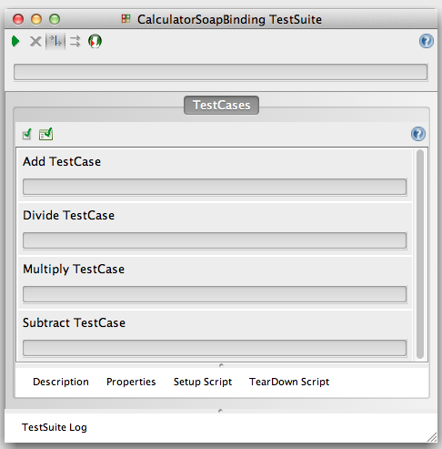
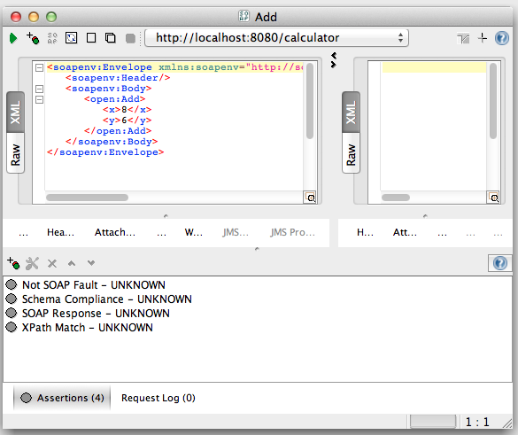
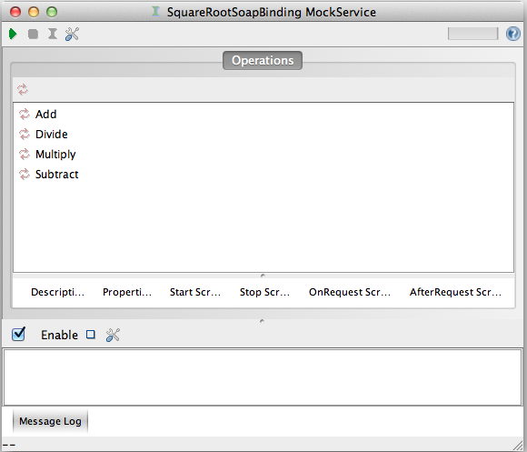

# Testing Web Services from JUnit using SoapUI

There is no doubt that [SoapUI](http://www.soapui.org/) is a superb tool for testing Web Services. Yet, some people seem to think that SoapUI is just used for manual testing. In addition to manual tests, SoapUI supports automated tests, that is, test suites. Test suites are a step in the right direction towards automation but running them still requires human intervention. In other words, the user still has to launch SoapUI and click on the `Run...` button. This doesn't go down well in a [CI](http://en.wikipedia.org/wiki/Continuous_integration) environment.

Since SoapUI is a Java application, test suites can be invoked directly from JUnit removing the need for human intervention. On my GitHub page, I've uploaded a project that demonstrates how to do this. The project has a JUnit test case that launches a SoapUI mock Web Service and then invokes the test suite for it. Let me give a brief overview on how I went about developing the project.

The first step was to set up a SoapUI project and test suite based on a WSDL. There's plenty of [documentation online](http://www.soapui.org/Functional-Testing/structuring-and-running-tests.html) on how to do this. In the test suite, I created a test case for each WSDL operation:


For every test case, I asserted that the SOAP response isn't a SOAP fault, complies with the schema, it's a valid SOAP response and the outcome of the operation is correct:


The next step was to create a mock Web Service in the same project so I have something to run the test suite against. Again, there is [documentation](http://www.soapui.org/Getting-Started/mock-services.html) out there on this.


Now it was time to start developing the JUnit test case. I could have imported into my Java project the SoapUI libraries from the SoapUI distribution. But being a sadist, I decided to use Maven : P. In the project's POM, I declared the repo where to find SoapUI and its dependencies:

```xml
<repositories>
    <repository>
        <id>eviware</id>
        <url>http://www.soapui.org/repository/maven2</url>
    </repository>
</repositories>
```
[pom.xml](/pom.xml)

I then declared the dependencies that I want to be retrieved and included in the classpath:

```xml
<dependencies>
    ...
    <dependency>
        <groupId>commons-lang</groupId>
        <artifactId>commons-lang</artifactId>
        <version>2.4</version>
        <scope>test</scope>
    </dependency>
    <dependency>
        <groupId>commons-beanutils</groupId>
        <artifactId>commons-beanutils</artifactId>
        <version>1.7.0</version>
        <scope>test</scope>
    </dependency>
    <dependency>
        <groupId>commons-collections</groupId>
        <artifactId>commons-collections</artifactId>
        <version>3.2.1</version>
        <scope>test</scope>
    </dependency>
    <dependency>
        <groupId>log4j</groupId>
        <artifactId>log4j</artifactId>
        <version>1.2.8</version>
        <scope>test</scope>
    </dependency>
    <dependency>
        <groupId>commons-cli</groupId>
        <artifactId>commons-cli</artifactId>
        <version>1.0</version>
        <scope>test</scope>
    </dependency>
    <dependency>
        <groupId>saxon</groupId>
        <artifactId>saxon-dom</artifactId>
        <version>9.1.0.8j</version>
        <scope>test</scope>
    </dependency>
    <dependency>
        <groupId>javax.jms</groupId>
        <artifactId>jms</artifactId>
        <version>1.1</version>
        <scope>test</scope>
    </dependency>
    <dependency>
        <groupId>javax.mail</groupId>
        <artifactId>mail</artifactId>
        <version>1.4</version>
        <scope>test</scope>
    </dependency>
    <dependency>
        <groupId>org.mortbay.jetty</groupId>
        <artifactId>servlet-api</artifactId>
        <version>2.5-20081211</version>
        <scope>test</scope>
    </dependency>
    <dependency>
        <groupId>wsdl4j</groupId>
        <artifactId>wsdl4j</artifactId>
        <version>1.6.2</version>
        <scope>test</scope>
    </dependency>
    <dependency>
        <groupId>eviware</groupId>
        <artifactId>soapui</artifactId>
        <version>4.5.1</version>
        <scope>test</scope>
    </dependency>
    <dependency>
        <groupId>eviware</groupId>
        <artifactId>soapui-xmlbeans</artifactId>
        <version>4.5.1</version>
        <scope>test</scope>
    </dependency>
    <dependency>
        <groupId>xmlbeans</groupId>
        <artifactId>xbean_xpath</artifactId>
        <version>2.4.0</version>
        <scope>test</scope>
    </dependency>
    <dependency>
        <groupId>xmlbeans</groupId>
        <artifactId>xbean</artifactId>
        <version>fixed-2.4.0</version>
        <scope>test</scope>
    </dependency>
    <dependency>
        <groupId>org.apache.httpcomponents</groupId>
        <artifactId>httpclient</artifactId>
        <version>4.1.1</version>
        <scope>test</scope>
    </dependency>
    <dependency>
        <groupId>fife</groupId>
        <artifactId>rsyntaxtextarea</artifactId>
        <version>2.0.1</version>
        <scope>test</scope>
    </dependency>
    <dependency>
        <groupId>xerces</groupId>
        <artifactId>xercesImpl</artifactId>
        <version>2.9.1</version>
        <scope>test</scope>
    </dependency>
    <dependency>
        <groupId>bouncycastle</groupId>
        <artifactId>bcprov-jdk15</artifactId>
        <version>144</version>
        <scope>test</scope>
    </dependency>
    <dependency>
        <groupId>xmlunit</groupId>
        <artifactId>xmlunit</artifactId>
        <version>1.2</version>
        <scope>test</scope>
    </dependency>
    <dependency>
        <groupId>amf</groupId>
        <artifactId>flex-messaging-common</artifactId>
        <version>1.0</version>
        <scope>test</scope>
    </dependency>
    <dependency>
        <groupId>amf</groupId>
        <artifactId>flex-messaging-core</artifactId>
        <version>1.0</version>
        <scope>test</scope>
    </dependency>
    <dependency>
        <groupId>eviware</groupId>
        <artifactId>soap-xmlbeans</artifactId>
        <version>1.2</version>
        <scope>test</scope>
    </dependency>
    <dependency>
        <groupId>saxon</groupId>
        <artifactId>saxon</artifactId>
        <version>9.1.0.8j</version>
        <scope>test</scope>
    </dependency>
    <dependency>
        <groupId>jetty</groupId>
        <artifactId>jetty</artifactId>
        <version>6.1.26</version>
        <scope>test</scope>
    </dependency>
    <dependency>
        <groupId>jetty</groupId>
        <artifactId>jetty-util</artifactId>
        <version>6.1.26</version>
        <scope>test</scope>
    </dependency>
</dependencies>
```
[pom.xml](/pom.xml)


The last step was to write the test for my Web Service:
```java
...
 
public class CalculatorServiceTestCase  {
 
    @Test
    public void testCalculatorService() throws Exception {
        SoapUITestCaseRunner testCaseRunner = new SoapUITestCaseRunner();
        SoapUIMockServiceRunner mockServiceRunner = new SoapUIMockServiceRunner();
 
        testCaseRunner.setProjectFile("src/test/resources/calculator-soapui-project.xml");
        mockServiceRunner.setProjectFile("src/test/resources/calculator-soapui-project.xml");
        mockServiceRunner.run();
        testCaseRunner.run();
    }
}
```
[CalculatorServiceTestCase.java](/src/test/java/org.opensourcesoftwareandme/CalculatorServiceTestCase.java)

`testCalculatorService` is annotated with `@Test` which instructs the JUnit runner to execute the test. What the test does is simple:
1. It loads the test suite and mock Web Service configurations from the SoapUI project `calculator-soapui-project.xml`
2. Launch the mock Web Service
3. Execute the test suite
You can run the test by typing in your console `mvn test` in the project root directory.
